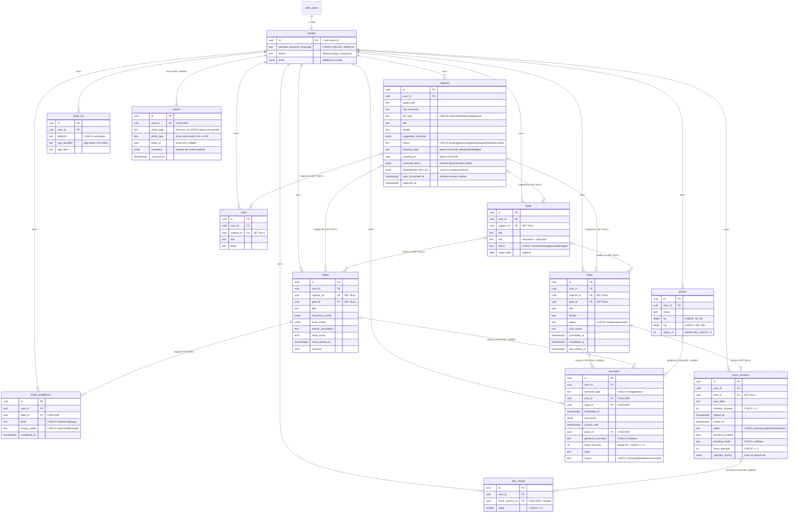

# Sidekick — Entity Relationship Diagram

Generated from `supabase/migrations/0001_initial_schema.sql` plus the additive
`0002_events_log.sql` and `0004_capture_decomposition.sql` (post-P1-lock migrations).
This diagram matches those migrations exactly (every table and relationship). Sync/audit columns
(`created_at`, `updated_at`, `deleted_at`) are present on every syncable table and
omitted from the boxes below only to keep the diagram readable — they are called
out in `SCHEMA.md`.

Every parent→child FK below is **composite** — `(parent_id, user_id) REFERENCES
parent(id, user_id)` — so a child can only attach to a parent owned by the same
user (see `SCHEMA.md §Same-user FK ownership`). Cardinality `o|--o{` marks a
nullable/optional parent link; `||--o{` a mandatory one.

> `events` (additive migration `0002`, post-P1-lock) has only the `profiles` ownership edge:
> its `entity_type` / `entity_id` is a **loose polymorphic link with no FK** (like
> `captures.resulting_id`), so no edge is drawn to tasks/habits/etc. Append-only + immutable —
> see [`EVENTS.md`](./EVENTS.md).

## Relationship / ON DELETE summary

All child FKs are composite `(fk_col, user_id) → parent(id, user_id)`. SET-NULL rows
use PG15 column-list `SET NULL (fk_col)` so only the FK column is nulled, never the
NOT NULL `user_id`.

| Parent → Child | FK | ON DELETE | Why |
|---|---|---|---|
| auth.users → profiles | profiles.id | CASCADE | profile is meaningless without the user |
| profiles → every table | *.user_id | CASCADE | deleting the account removes all their data |
| profiles → events (0002) | events.user_id | CASCADE | deleting the account removes their event log |
| captures → tasks/notes/habits/goals | (capture_id, user_id) | SET NULL (capture_id) | the typed record outlives the raw capture |
| goals → tasks/habits | (goal_id, user_id) | SET NULL (goal_id) | deleting a goal must not delete the work under it |
| habits → habit_completions | (habit_id, user_id) | CASCADE | a completion has no meaning without its habit |
| tasks → focus_sessions | (task_id, user_id) | SET NULL (task_id) | keep session history even if the task is deleted |
| focus_sessions → vibe_checks | (focus_session_id, user_id) | CASCADE | the vibe check belongs to that session |
| tasks/habits → reminders | (task_id, user_id) / (habit_id, user_id) | CASCADE | a reminder for a deleted target is noise |
| places → reminders | (place_id, user_id) | CASCADE | a geofence reminder for a deleted place is noise |
